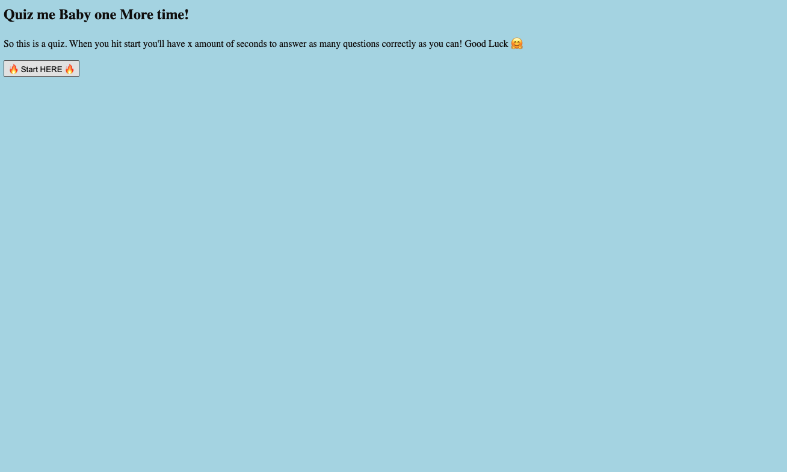

## Coding-Quiz

Depoloyed Website: https://minnieakuma199.github.io/Coding-Quiz/ 

# Purpose 

The purpose of this assignment was to create a quiz. When the user hits the start button the timer begins and quiz questions are displayed. If user chooses the incorrect answer then -5 seconds is taken off the timer. 

# What I learned

This project was done entirely in vanilla JavaScript. 